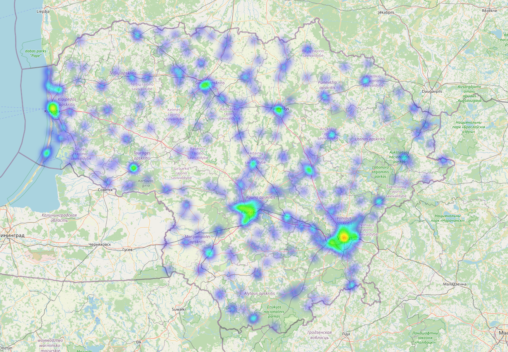

# Lithuanian Real Estate Listings

## Description
This repository contains a comprehensive dataset of real estate listings in Lithuania, now updated with apartment data from aruodas.lt as of February 2024. In the future, this repository will be expanded to include various types of properties (houses, land, etc.) and data from various providers.

## Repository Structure
```
lithuanian-real-estate-listings/
│
├── data/
│   ├── apartments/
│   │   └── all_cities_20240208.csv
│   ├── houses/ (coming soon)
│   ├── land/ (coming soon)
│   └── ... (additional categories)
│
└── docs/
    ├── images/
    │   └── wordcloud_descriptions.png
    ├── maps/
    │   └── lithuania_listings_density_map.html
    └── ...
```

## Data Example and Statistics
The `data/apartments/all_cities_20240208.csv` file contains detailed listings of apartments across various cities in Lithuania. Below are updated statistics highlighting key aspects of the dataset:

- **Total Listings**: 7,599
- **Columns**: 38, including detailed information such as area, price, building type, coordinates, and more.

### Key Statistics:
- **Price Range**: 43 to 2,500,000
- **Number of Rooms**: Ranging from 1 to 13
- **Building Types**: Majority are Brick (5,290) and Block House (1,753)
- **Average Prices**:
  - By Professional Brokers: 2,513.43 EUR per sqm
  - By Private Sellers: 2,389.11 EUR per sqm
- **Average Description Length**:
  - By Professional Brokers: 1,573.17 characters
  - By Private Sellers: 986.21 characters
- **Average Number of Images**:
  - By Professional Brokers: 18.81 images per listing
  - By Private Sellers: 16.02 images per listing
- **Listings Distribution**:
  - Professional Brokers: 70.94%
  - Private Sellers: 29.06%

This dataset provides a comprehensive view of the real estate market in Lithuania, offering insights into listing characteristics by both private sellers and professional brokers.

## Market Insights

1. **Broker Dominance**: The market is predominantly managed by professional brokers, who account for approximately 71% of the listings. This suggests a strong reliance on professional services for real estate transactions in Lithuania, possibly due to the complexities involved in the buying, selling, and renting processes that favor the expertise of professional brokers.

2. **Pricing Insights**:
   - The average price per square meter is slightly higher for listings managed by professional brokers (2,513.43 EUR) compared to those by private sellers (2,389.11 EUR). This could indicate that brokers may handle properties that are either more valuable or located in more desirable areas. Additionally, it might reflect the added value or premium that comes with professional brokerage services, such as better presentation, marketing efforts, and negotiation skills leading to higher asking prices.

3. **Descriptive Details**:
   - Listings by professional brokers tend to have significantly longer descriptions (over 50% longer on average) than those by private sellers. This could suggest a more comprehensive approach to marketing by professionals, who may invest more effort into highlighting the features and benefits of the properties to attract potential buyers or renters.

4. **Visual Presentation**:
   - Professional brokers also tend to include more images per listing compared to private sellers. This emphasis on visual presentation could enhance the appeal of the listings and provide a more detailed view of the properties, potentially leading to quicker sales or rentals.

5. **Market Composition and Accessibility**:
   - The presence of a substantial proportion of listings by private sellers (nearly 30%) indicates a significant level of direct seller engagement in the market, which could appeal to buyers or renters looking for deals without brokerage fees. This diversity in listing management can enhance market accessibility and options for all parties involved.

These insights underscore the nuanced dynamics of the Lithuanian real estate market, highlighting the importance of professional brokerage services in enhancing property value and marketability, while also pointing to a vibrant segment of the market where private sellers actively participate. The detailed approach to descriptions and the emphasis on visual presentation by professional brokers could serve as valuable lessons for private sellers aiming to improve the competitiveness of their listings.


## How to Use
- Download the desired CSV files from the `data/` directory.
- Load the data using a CSV reader in your preferred programming language or software.
- Refer to the `examples/` directory for sample code and analysis (if available).

## Visualizations
- **Density Map of Listings**: An interactive map showing the geographical distribution of listings across Lithuania. 
- **Word Cloud of Descriptions**: A visual representation of common keywords found in the property descriptions. [Word Cloud](docs/images/wordcloud_descriptions.png)

## License
This dataset is made available under the [Attribution-NonCommercial 4.0 International license](LICENSE). By using this data, you agree to the terms of this license.

---

*This README is subject to updates as the repository grows and evolves.*
